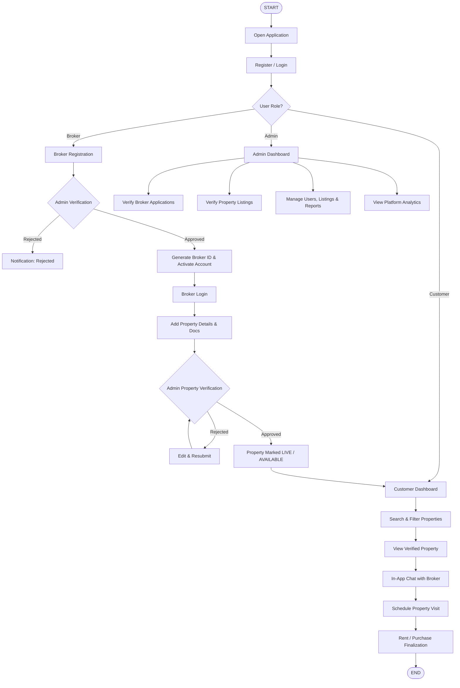
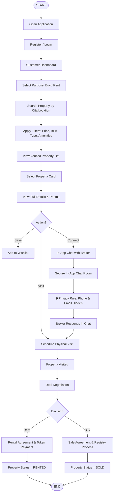
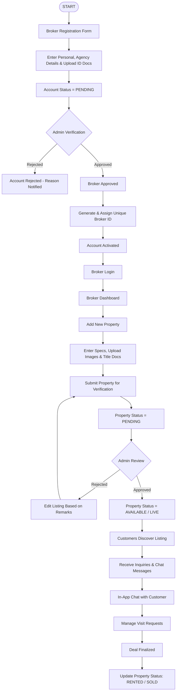
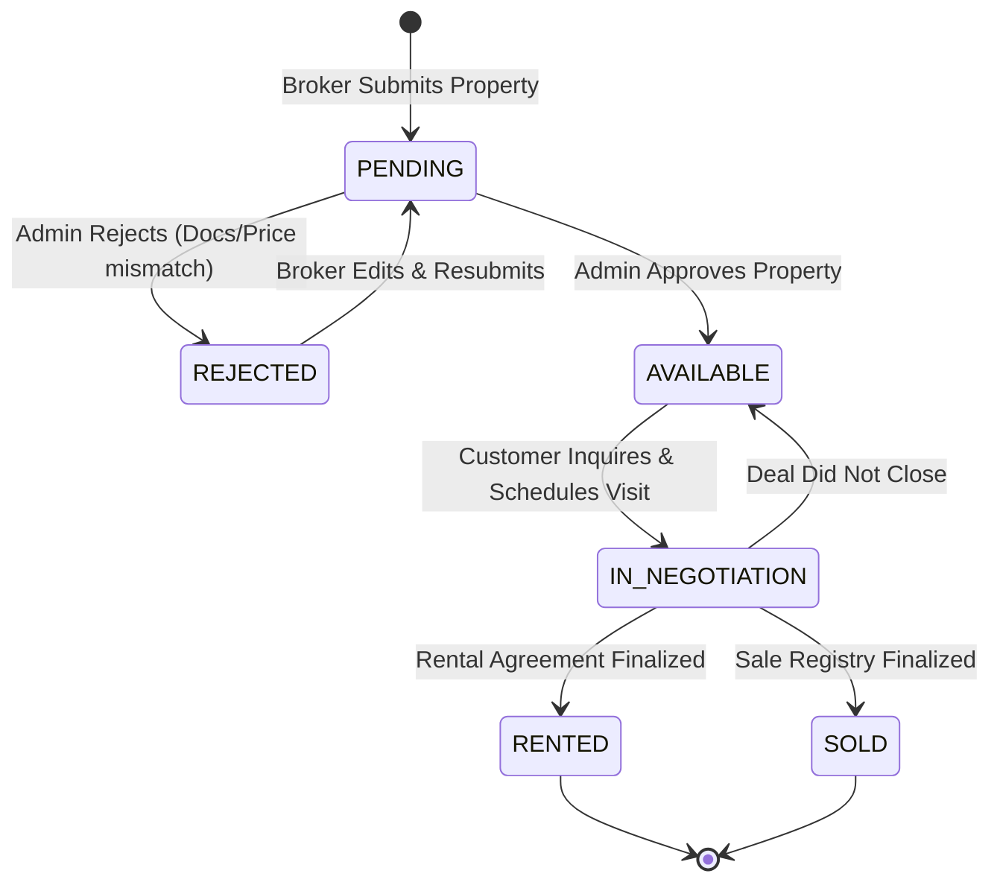
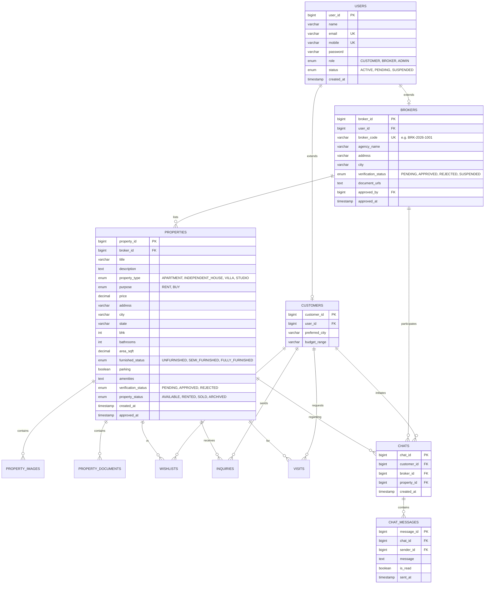
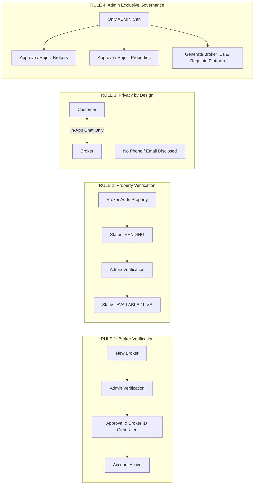

# 🏠 House Rental & Buyer App — Software Requirements Specification (SRS)

---

## 0. Project Introduction

### Project Name
**House Rental & Buyer App** (Brand Name: **HouseHub**)

### Project Overview
**House Rental & Buyer App** ek full-stack web-based real estate platform hai jo customers/tenants ko verified properties rent ya buy karne ke liye ek transparent aur secure online platform provide karta hai.

System mein teen (3) primary user roles hain:
1. **Customer / Tenant**
2. **Broker / Owner**
3. **Admin**

Customer bina apna personal contact number ya email share kiye properties search kar sakta hai, detailed specifications aur images dekh sakta hai, aur directly broker ke sath secure in-app chat kar sakta hai.

Broker properties add kar sakta hai, lekin koi bhi property directly live nahi hogi. Property details pehle Admin ke paas verification ke liye jayengi. Admin approval ke baad hi property customer search listing mein visible hogi.

Similarly, jab koi new broker registration karta hai, uski details Admin verification queue mein jati hain. Admin verification aur approval ke baad hi broker ka account activate hota hai aur unique **Broker ID** generate/assign hoti hai.

### Main Objective
- **Property Search Streamlining**: City, price, BHK, property type aur purpose (Rent/Buy) ke through fast aur accurate search.
- **Centralized Platform**: Renting aur buying dono workflows ko ek cohesive portal mein integrate karna.
- **Privacy & Secure In-App Communication**: Customer aur broker ke beech without phone/email exchange seamless in-app chat provide karna.
- **Zero Fake Listings (Admin Verification)**: Mandatorily verified broker profiles aur property listings allow karna taaki platform trust 100% maintain rahe.
- **Structured Listing & Deal Lifecycle**: Property status tracking: `PENDING` ➔ `APPROVED / AVAILABLE` ➔ `RENTED` / `SOLD`.

---

## 1. Project Scope

### 1.1 Customer / Tenant
- **Authentication**: Customer registration aur login.
- **Search & Discovery**: Purpose choose karna (Buy / Rent), search by location/city.
- **Filters**: Price range, BHK (1 BHK, 2 BHK, 3 BHK+), Property Type (Apartment, Independent House, Villa), Amenities.
- **Property Details**: High-resolution image gallery, price, dimensions, furnished status, parking, etc.
- **Wishlist / Favorites**: Properties ko baad mein dekhne ke liye save karna.
- **Inquiry & In-App Chat**: 
  - Direct inquiry message bhejna.
  - **In-App Chat**: Broker ke sath direct chat karna (phone number aur email hide rahenge).
- **Visit Scheduling**: Property physical visit request schedule karna aur uska status track karna (`Requested`, `Confirmed`, `Completed`, `Cancelled`).
- **Rental / Purchase Request**: Deal finalize karne ke liye formal intent submit karna.

### 1.2 Broker / Owner
- **Registration**: Personal, agency details aur identification documents submit karna.
- **Verification Wait**: Status `PENDING` rahega jab tak Admin approve nahi karta.
- **Broker ID & Activation**: Approval ke baad official Broker ID receive karna aur login activate hona.
- **Property Management**:
  - New property add karna (title, price, location, BHK, amenities, area, photos, verification documents).
  - Verification ke liye submit karna (`PENDING`).
  - Admin approval ke baad property `AVAILABLE / LIVE` hona.
  - Admin rejection par feedback dekhkar edit aur resubmit karna.
- **Lead & Communication Management**:
  - Customer inquiries receive karna.
  - In-app chat ke through customer queries ka reply dena (without personal contact details exposure).
  - Visit requests accept/reschedule karna.
- **Status Update**: Deal hone par property status ko `RENTED` ya `SOLD` mark karna.

### 1.3 Admin
- **Broker Verification Queue**:
  - Pending broker registration requests review karna.
  - Submitted license/ID documents verify karna.
  - Broker approve ya reject karna.
  - Approved broker ke liye unique **Broker ID** generate/assign karna.
- **Property Verification Queue**:
  - Pending property listings aur ownership/permission documents review karna.
  - Property approve ya reject karna.
  - Approved property ko publicly `AVAILABLE` publish karna.
- **Platform Management**:
  - All users (Customers, Brokers) manage/suspend karna.
  - All property listings monitor karna.
  - Complaints, reports aur fraudulent activity handle karna.
- **Analytics & Platform Statistics**: Total users, total active listings, rent vs buy breakdown, monthly deals metrics dekhna.

---

## 2. Technology Stack

### Frontend
- **HTML5**: Semantic web structure
- **CSS3**: Custom modern styling, flexbox, CSS grid, responsive UI
- **JavaScript (ES6+)**: Dynamic DOM manipulation, fetch API, asynchronous data handling
- **CSS Variables & Themes**: Clean light-mode real estate UI

### Backend
- **Java (JDK 17+)**
- **Spring Boot 3.x**
  - Spring Web (RESTful Web Services)
  - Spring Data JPA (Database ORM)
  - Spring Security & JWT (Role-Based Access Control)
  - Bean Validation (Hibernate Validator)

### Database
- **MySQL 8.x**: Relational database storage

### API & Protocols
- **RESTful APIs** with JSON request/response payloads
- **HTTP / HTTPS**

### Development Tools
- **IDE**: VS Code / IntelliJ IDEA
- **Database Client**: MySQL Workbench
- **API Testing**: Postman
- **Version Control**: Git & GitHub

### Project Architecture Flow
```
Frontend (HTML / CSS / JS)
       │
   (Fetch API)
       ↓
REST Controller (Spring Boot)
       ↓
Service Layer (Business Logic & Verification Rules)
       ↓
Repository Layer (Spring Data JPA)
       ↓
MySQL Database
```

---

## 3. Overall System Flowchart



---

## 4. Customer / Tenant Complete Flowchart



> [!IMPORTANT]
> **Privacy Rule**: Customer ka phone number aur email address broker ko directly expose nahi hoga. Saari communication application ke internal chat system se encrypted aur sandboxed context mein hogi.

---

## 5. Broker / Owner Complete Flowchart



---

## 6. Admin Complete Flowchart

```mermaid
flowchart TD
    Start([START]) --> Login[Admin Login]
    Login --> Dash[Admin Dashboard]
    
    Dash --> Split{Verification Category}
    
    %% Broker Queue
    Split -->|Brokers| BrokerQueue[Review Pending Broker Requests]
    BrokerQueue --> CheckBDocs[Verify ID & License Documents]
    CheckBDocs --> BDecision{Approval Decision}
    BDecision -->|Reject| RejectB[Reject Application with Reason]
    BDecision -->|Approve| ApproveB[Approve Application]
    ApproveB --> GenerateBID[Generate & Assign Broker ID]
    GenerateBID --> NotifyB[Notify Broker & Enable Login]
    
    %% Property Queue
    Split -->|Properties| PropQueue[Review Pending Property Listings]
    PropQueue --> CheckPDocs[Verify Ownership Details & Pricing]
    CheckPDocs --> PDecision{Approval Decision}
    PDecision -->|Reject| RejectP[Reject Listing with Remarks]
    PDecision -->|Approve| ApproveP[Approve Listing]
    ApproveP --> PublishP[Publish Property to Public Search (AVAILABLE)]
    
    %% Management & Analytics
    Split -->|Platform Control| ManageUsers[Manage Users, Brokers & Listings]
    ManageUsers --> Reports[Review Complaints & Violations]
    Reports --> Analytics[View Platform KPI Analytics & Revenue Metrics]
    Analytics --> Done([END])
```

---

## 7. Registration & Login Flow

### 7.1 Customer Registration
```
Customer ➔ Register Form ➔ Enter Name, Email, Mobile, Password ➔ Validate Input ➔ Account Created (Active) ➔ Login ➔ Customer Dashboard
```

### 7.2 Broker Registration (Verification Guarded)
```
Broker ➔ Register Form ➔ Professional & Agency Info + Document Uploads ➔ Status: PENDING ➔ Admin Verification Queue
                                                                                              │
                                         ┌────────────────────────────────────────────────────┴───────────────────────────┐
                                         ↓                                                                                 ↓
                                  [Admin Rejects]                                                                   [Admin Approves]
                                         ↓                                                                                 ↓
                                Status: REJECTED                                                                     Status: APPROVED
                                         ↓                                                                                 ↓
                              Notification to Broker                                                            Assign Unique Broker ID
                                                                                                                           ↓
                                                                                                                   Activate Broker Account
                                                                                                                           ↓
                                                                                                                   Enable Broker Login
```

> [!CAUTION]
> **Business Rule**: Kisi bhi pending ya rejected broker ko active Broker ID nahi milegi aur na hi wo property add kar sakega jab tak Admin approve nahi karta.

---

## 8. Property Listing ➔ Verification ➔ Rent/Sale Flow

### Property Status Lifecycle
$$\text{PENDING} \longrightarrow \text{APPROVED / AVAILABLE} \longrightarrow \begin{cases} \text{RENTED} \\ \text{SOLD} \end{cases}$$



---

## 9. Use Case Specifications

### Actors
- **Customer / Tenant**: End-user searching for residential accommodation or purchase.
- **Broker / Owner**: Real estate intermediary or owner listing properties.
- **Admin**: System auditor, verifier, and platform regulator.

| Use Case ID | Use Case Name | Primary Actor | Pre-condition | Post-condition |
|:---|:---|:---|:---|:---|
| **UC-01** | Register Customer | Customer | None | Active Customer profile created |
| **UC-02** | Submit Broker Registration | Broker | None | Broker registration in `PENDING` state |
| **UC-03** | Verify Broker | Admin | Broker in `PENDING` | Broker `APPROVED` + Broker ID assigned OR `REJECTED` |
| **UC-04** | Search & Filter Properties | Customer | None | Matching verified listings displayed |
| **UC-05** | In-App Chat | Customer / Broker | Customer logged in, Property active | Direct messages exchanged without contact disclosure |
| **UC-06** | Submit Property Listing | Broker | Approved Broker logged in | Property listed with status `PENDING` |
| **UC-07** | Verify Property Listing | Admin | Property in `PENDING` | Property `AVAILABLE` (Live) OR `REJECTED` |
| **UC-08** | Schedule Visit | Customer | Property is `AVAILABLE` | Visit request forwarded to Broker |
| **UC-09** | Update Property Status | Broker | Property is `AVAILABLE` | Property updated to `RENTED` or `SOLD` |
| **UC-10** | Manage System Reports | Admin | Admin logged in | User/Property disciplined or resolved |

---

## 10. Database & Entity Structure



---

## 11. Complete Frontend Screen Flow

```
PUBLIC PAGES
├── Home (index.html)
├── Properties Search & Grid (properties.html)
├── Property Details (property-details.html)
├── About & Contact

AUTHENTICATION
├── Login (login.html)
├── Customer Registration (customer-register.html)
└── Broker Registration (broker-register.html) ➔ Pending Screen

CUSTOMER DASHBOARD
├── Overview (customer-dashboard.html)
├── Saved Wishlist (wishlist.html)
├── My Inquiries (my-inquiries.html)
├── In-App Chat (chat.html)
└── Profile (customer-profile.html)

BROKER DASHBOARD
├── Overview (broker-dashboard.html)
├── Add Property (add-property.html)
├── My Properties (my-properties.html)
├── Property Lifecycle Status (property-status.html)
├── In-App Chat (chat.html)
└── Profile (broker-profile.html)

ADMIN DASHBOARD
├── Admin Overview (admin-dashboard.html)
├── Broker Verification Queue (broker-verification.html)
├── Property Verification Queue (property-verification.html)
└── Platform Analytics & Reports
```

---

## 12. Functional Requirements (FR)

### Authentication & Authorization
- **FR-01**: System shall allow customers to self-register and immediately activate accounts.
- **FR-02**: System shall allow brokers to submit verification applications with required KYC/agency documents.
- **FR-03**: System shall prevent unverified brokers from logging in or creating property listings.
- **FR-04**: System shall generate a unique official `Broker ID` (e.g. `BRK-2026-1001`) automatically upon Admin approval.
- **FR-05**: System shall enforce Role-Based Access Control (RBAC) across `CUSTOMER`, `BROKER`, and `ADMIN`.

### Customer Features
- **FR-06**: Customer shall search properties by location, price bracket, BHK, purpose (Rent/Buy), and amenities.
- **FR-07**: Customer shall view detailed property pages including image galleries, features, and verification badges.
- **FR-08**: Customer shall add/remove listings to their personal Wishlist.
- **FR-09**: Customer shall initiate inquiries and property visit requests.
- **FR-10**: Customer shall communicate with brokers exclusively via internal In-App Chat without exposing mobile number or email.

### Broker Features
- **FR-11**: Broker shall add new properties with specifications, floor area, price, high-resolution photos, and ownership documents.
- **FR-12**: Newly added properties shall default to status `PENDING` and remain invisible to public search.
- **FR-13**: Broker shall review admin feedback on rejected listings, make modifications, and resubmit for review.
- **FR-14**: Broker shall manage incoming customer inquiries and respond through In-App Chat.
- **FR-15**: Broker shall mark active properties as `RENTED` or `SOLD` upon deal completion.

### Admin Features
- **FR-16**: Admin shall inspect pending broker applications, verify uploaded documents, and approve/reject with comments.
- **FR-17**: Admin shall inspect pending property listings, verify legitimacy and pricing, and approve/reject with comments.
- **FR-18**: Only Admin-approved properties (`verification_status = APPROVED`) shall be visible to customers.
- **FR-19**: Admin shall have the authority to suspend users, ban fraudulent brokers, or unlist disputed properties.
- **FR-20**: Admin shall monitor platform health, deal conversion, and listing volume through the analytics dashboard.

---

## 13. Non-Functional Requirements (NFR)

- **Security & Privacy**:
  - Passwords hashed using BCrypt.
  - Zero leakage of Customer contact details (mobile/email) to Brokers in the UI or REST responses.
  - JWT-based authentication for stateful session-less API security.
- **Performance**:
  - Property listing query responses $< 300\text{ ms}$ under standard loads.
  - Paginated search results (default 12 items per page).
- **Usability**:
  - 100% responsive UI on mobile, tablet, and desktop screens.
  - Explicit visual verification status badges (`Pending`, `Approved`, `Rejected`).
- **Data Integrity & Reliability**:
  - ACID transactions during property status changes and verification updates.
  - Relational foreign key constraints to prevent orphaned chats, images, or inquiries.
- **Maintainability**:
  - Clean layered architecture in Spring Boot (`Controller` ➔ `Service` ➔ `Repository` ➔ `Entity`).
  - Separation of Concerns between Frontend UI and Backend REST APIs.

---

## 14. REST API Specification

### 14.1 Authentication & Profile APIs
| Method | Endpoint | Access | Description |
|:---|:---|:---|:---|
| `POST` | `/api/auth/customer/register` | Public | Register new customer |
| `POST` | `/api/auth/broker/register` | Public | Submit broker registration application |
| `POST` | `/api/auth/login` | Public | Authenticate user & return JWT token + role |
| `GET` | `/api/users/profile` | Authenticated | Get current logged-in user profile |

### 14.2 Admin Verification APIs
| Method | Endpoint | Access | Description |
|:---|:---|:---|:---|
| `GET` | `/api/admin/brokers/pending` | Admin Only | Get all brokers awaiting verification |
| `PUT` | `/api/admin/brokers/{id}/approve` | Admin Only | Approve broker, generate Broker ID & activate |
| `PUT` | `/api/admin/brokers/{id}/reject` | Admin Only | Reject broker with remarks |
| `GET` | `/api/admin/properties/pending` | Admin Only | Get all properties awaiting review |
| `PUT` | `/api/admin/properties/{id}/approve` | Admin Only | Approve property & make publicly available |
| `PUT` | `/api/admin/properties/{id}/reject` | Admin Only | Reject property with feedback remarks |

### 14.3 Property Management APIs
| Method | Endpoint | Access | Description |
|:---|:---|:---|:---|
| `GET` | `/api/properties` | Public | Get all active, approved properties (paginated) |
| `GET` | `/api/properties/search` | Public | Search properties (`?city=...&purpose=...&bhk=...&minPrice=...`) |
| `GET` | `/api/properties/{id}` | Public | Get property full details by ID |
| `POST` | `/api/properties` | Broker | Add new property (sets `status = PENDING`) |
| `PUT` | `/api/properties/{id}` | Broker | Update property details |
| `PUT` | `/api/properties/{id}/status` | Broker | Update lifecycle status (`AVAILABLE`, `RENTED`, `SOLD`) |
| `GET` | `/api/properties/my-properties` | Broker | Get listings owned by logged-in broker |

### 14.4 In-App Chat APIs (Privacy-Guarded)
| Method | Endpoint | Access | Description |
|:---|:---|:---|:---|
| `POST` | `/api/chats` | Customer | Create or get existing chat room for property & broker |
| `GET` | `/api/chats` | Cust / Broker | List active chat conversations |
| `GET` | `/api/chats/{chatId}/messages` | Participants | Get message history for a conversation |
| `POST` | `/api/chats/{chatId}/messages` | Participants | Send message in chat room |
| `PUT` | `/api/chats/{chatId}/read` | Participants | Mark unread messages as read |

### 14.5 Inquiry & Visit APIs
| Method | Endpoint | Access | Description |
|:---|:---|:---|:---|
| `POST` | `/api/inquiries` | Customer | Send inquiry for a property |
| `GET` | `/api/inquiries/customer` | Customer | View submitted inquiries |
| `GET` | `/api/inquiries/broker` | Broker | View incoming property inquiries |
| `POST` | `/api/visits` | Customer | Request property site visit |
| `GET` | `/api/visits/broker` | Broker | View and accept/reschedule site visits |

---

## 15. Frontend — Backend Architecture & Team Division

```
                      GITHUB REPOSITORY (House-rental-Buyer-App)
                                         │
                 ┌───────────────────────┴───────────────────────┐
                 ↓                                               ↓
       DEVELOPER 1 (YOU)                              DEVELOPER 2 (FRIEND)
         [FRONTEND]                                       [BACKEND]
                 ↓                                               ↓
        HTML5 / CSS3 / JavaScript                        Java 17 / Spring Boot 3
                 ↓                                               ↓
         Fetch API / AJAX                                 REST Controllers
                 ↓                                               ↓
                 └────────────── JSON API CONTRACT ──────────────┘
                                         ↓
                                   MySQL Database
```

### Responsibility Matrix

#### Developer 1: Frontend Scope
- Complete page UI & responsive layouts (`index.html`, `properties.html`, dashboards).
- Client-side form validations & error messages.
- Privacy-guarded In-App Chat Interface.
- Admin verification action screens for Broker and Property approval.
- API integration using `fetch()` and dynamic DOM updates.

#### Developer 2: Backend Scope
- Spring Boot architecture, Maven/Gradle setup, and project structuring.
- MySQL schema migrations, JPA Entities, and Spring Data Repositories.
- JWT-based authentication & role-based security filters (`CUSTOMER`, `BROKER`, `ADMIN`).
- Business logic for verification pipelines & automatic Broker ID generation.
- RESTful controller endpoints matching Section 14 contract.

---

## 16. End-to-End Development & Integration Roadmap

```
Phase 1: Architecture & API Contract Finalization
   ↓
Phase 2: Repository Branching & Workspace Structuring
   ↓
Phase 3: Frontend UI Completion (with Mock / localStorage State)
   ↓
Phase 4: Backend REST API & Database Implementation
   ↓
Phase 5: API Verification via Postman
   ↓
Phase 6: Frontend ➔ Backend Integration (Replace Mock with fetch)
   ↓
Phase 7: End-to-End System Testing & Deployment
```

### Complete End-to-End Verification Scenario
```
1. Broker Registers (Status: PENDING)
2. Admin Dashboard views pending broker application & documents
3. Admin approves broker ➔ System generates official Broker ID (e.g., BRK-2026-1001)
4. Broker logs in and uploads new property listing with pictures
5. Property enters queue with Status: PENDING (hidden from search)
6. Admin views pending property review queue and approves listing
7. Property marked AVAILABLE and immediately appears in Customer Search
8. Customer searches by city/budget, discovers listing, and opens In-App Chat
9. Customer and Broker communicate without sharing phone numbers or emails
10. Customer schedules visit ➔ Physical inspection conducted ➔ Deal confirmed
11. Broker marks property status as RENTED or SOLD
```

---

## 17. Future Scope

Current requirements se isolated rakhte hue, platform ke future iterations mein nimn features incorporate kiye ja sakte hain:

1. **Integrated Online Payment Gateway**:
   - Razorpay / Stripe integration for token advance, security deposit, and monthly rent auto-debit.
2. **Interactive Map & Geo-Location (Google Maps / Mapbox)**:
   - Visual map search, radius filtering, and nearby landmarks (schools, metro stations, hospitals).
3. **Real-Time WebSocket Chat**:
   - Upgrading REST polling to STOMP over WebSockets for instant typing indicators and live read receipts.
4. **Automated Multi-Channel Notifications**:
   - Push notifications, SMS alerts, and email digests for new inquiries, visit approvals, and chat pings.
5. **Digital Rental Agreement Generation & E-Sign**:
   - Auto-population of tenant-landlord agreements with Aadhaar e-Sign integration.
6. **AI-Powered Property Recommendations & Valuation**:
   - Smart recommendation engine based on user browsing behavior and fair market price estimation.
7. **Cross-Platform Native Mobile Apps**:
   - Dedicated Flutter / React Native mobile applications for iOS and Android.

---

## 🎯 The 4 Golden Business Rules of the Application


